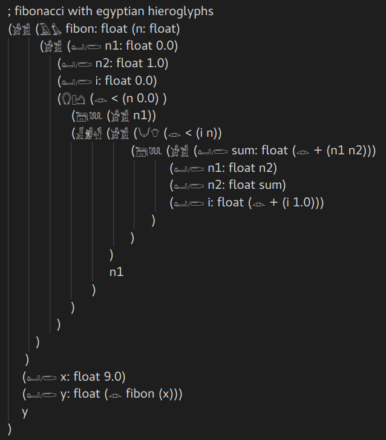

# ΛΣ - LambdaScript - ΛΣ

A tiny turing complete language with lisp syntax.


We only have the following data types:

- `Double`: `0.01`
- `String`: `"Hello World"`
- `Boolean`: `true` | `false`

Here is a hello world for the LambdaScript

```
; this is a hello world script for lambdascript
(seq "Hello World")

```

Here is a function computing a fibonacci sequence

```
; simple fibonacci code with a loop
(seq (fn fibon: float (n: float)
         (seq (def n1: float 0.0)
              (def n2: float 1.0)
              (def i: float 0.0)
              (if (do < (n 0.0) )
                  (then (seq n1))
                  (else (seq (loop (do < (i n))
                                   (then (seq (def sum: float (do + (n1 n2)))
                                              (def n1: float n2)
                                              (def n2: float sum)
                                              (def i: float (do + (i 1.0)))
                                         )
                                   )
                             )
                             n1
                        )
                  )
              )
        )
     )
    (def x: float 9.0)
    (def y: float (do fibon (x)))
    y
)

```
Should output `34.0`.

## Highlights

The main feature of this language is its exchangeable keywords:

Here is the same fibonacci sequence function with different keywords:

- Egyptian Hieroglyphs:

```
; fibonacci with egyptian hieroglyphs
(𓀂𓀃 (𓄿𓅊 fibon: float (n: float)
         (𓀂𓀃 (𓂠𓂨 n1: float 0.0)
              (𓂠𓂨 n2: float 1.0)
              (𓂠𓂨 i: float 0.0)
              (𓂘𓂛 (𓁹 < (n 0.0) )
                  (𓆋𓆚 (𓀂𓀃 n1))
                  (𓁕𓁖𓁗 (𓀂𓀃 (𓄋𓄣 (𓁹 < (i n))
                                   (𓆋𓆚 (𓀂𓀃 (𓂠𓂨 sum: float (𓁹 + (n1 n2)))
                                              (𓂠𓂨 n1: float n2)
                                              (𓂠𓂨 n2: float sum)
                                              (𓂠𓂨 i: float (𓁹 + (i 1.0)))
                                         )
                                   )
                             )
                             n1
                        )
                  )
              )
        )
     )
    (𓂠𓂨 x: float 9.0)
    (𓂠𓂨 y: float (𓁹 fibon (x)))
    y
)
```

If you have code2003 font installed in your system, you should see the
following image:



- Turkish

```
; fibonacci tr
(liste (edim fibon: float (n: float)
         (liste (tanım n1: float 0.0)
              (tanım n2: float 1.0)
              (tanım i: float 0.0)
              (eğer (yap < (n 0.0) )
                  (ise (liste n1))
                  (yoksa (liste (dongu (yap < (i n))
                                   (ise (liste (tanım sum: float (yap + (n1 n2)))
                                              (tanım n1: float n2)
                                              (tanım n2: float sum)
                                              (tanım i: float (yap + (i 1.0)))
                                         )
                                   )
                             )
                             n1
                        )
                  )
              )
        )
     )
    (tanım x: float 9.0)
    (tanım y: float (yap fibon (x)))
    y
)

```

- Kurdish

```
; fibonacci kur
(listeya (kari fibon: float (n: float)
         (listeya (binavkirin n1: float 0.0)
              (binavkirin n2: float 1.0)
              (binavkirin i: float 0.0)
              (eger (webike < (n 0.0) )
                  (paşan (listeya n1))
                  (wekidi (listeya (çerxeke (webike < (i n))
                                   (paşan (listeya (binavkirin sum: float
                                   (webike + (n1 n2)))
                                              (binavkirin n1: float n2)
                                              (binavkirin n2: float sum)
                                              (binavkirin i: float (webike + (i 1.0)))
                                         )
                                   )
                             )
                             n1
                        )
                  )
              )
        )
     )
    (binavkirin x: float 9.0)
    (binavkirin y: float (webike fibon (x)))
    y
)
```

- Arabic

```
; fibonacci ara
(قائمة (وظيفة fibon: float (n: float)
         (قائمة (حدد n1: float 0.0)
              (حدد n2: float 1.0)
              (حدد i: float 0.0)
              (لو (افعل < (n 0.0) )
                  (ثم (قائمة n1))
                  (آخر (قائمة (حلقهزدن (افعل < (i n))
                                   (ثم (قائمة (حدد sum: float (افعل + (n1 n2)))
                                              (حدد n1: float n2)
                                              (حدد n2: float sum)
                                              (حدد i: float (افعل + (i 1.0)))
                                         )
                                   )
                             )
                             n1
                        )
                  )
              )
        )
     )
    (حدد x: float 9.0)
    (حدد y: float (افعل fibon (x)))
    y
)

```

- Persian

```
; fibonacci per
(لیست (عملکرد fibon: float (n: float)
         (لیست (مشخصکردن n1: float 0.0)
              (مشخصکردن n2: float 1.0)
              (مشخصکردن i: float 0.0)
              (اگر (انجامدهید < (n 0.0) )
                  (سپس (لیست n1))
                  (دیگری (لیست (حلقهزدن (انجامدهید < (i n))
                                   (سپس (لیست (مشخصکردن sum: float (انجامدهید + (n1 n2)))
                                              (مشخصکردن n1: float n2)
                                              (مشخصکردن n2: float sum)
                                              (مشخصکردن i: float (انجامدهید + (i 1.0)))
                                         )
                                   )
                             )
                             n1
                        )
                  )
              )
        )
     )
    (مشخصکردن x: float 9.0)
    (مشخصکردن y: float (انجامدهید fibon (x)))
    y
)

```

- French

```
; fibonacci fr
(tableau (fonction fibon: float (n: float)
         (tableau (déf n1: float 0.0)
              (déf n2: float 1.0)
              (déf i: float 0.0)
              (si (faire < (n 0.0) )
                  (alors (tableau n1))
                  (sinon (tableau (boucle (faire < (i n))
                                   (alors (tableau (déf sum: float (faire + (n1 n2)))
                                              (déf n1: float n2)
                                              (déf n2: float sum)
                                              (déf i: float (faire + (i 1.0)))
                                         )
                                   )
                             )
                             n1
                        )
                  )
              )
        )
     )
    (déf x: float 9.0)
    (déf y: float (faire fibon (x)))
    y
)
```

- German

```
; fibonacci ger
(List (Prozedur fibon: float (n: float)
         (List (beschreib n1: float 0.0)
              (beschreib n2: float 1.0)
              (beschreib i: float 0.0)
              (wenn (tun < (n 0.0) )
                  (dann (List n1))
                  (sonst (List (Schleife (tun < (i n))
                                   (dann (List (beschreib sum: float (tun + (n1 n2)))
                                              (beschreib n1: float n2)
                                              (beschreib n2: float sum)
                                              (beschreib i: float (tun + (i 1.0)))
                                         )
                                   )
                             )
                             n1
                        )
                  )
              )
        )
     )
    (beschreib x: float 9.0)
    (beschreib y: float (tun fibon (x)))
    y
)
```

Basically if you want to use extended keywords feature you need to provide a
`keywords.lambda.txt` file to compiler. As in:

```
./lambdascript.out keywords.lambda.txt fibonacci-egy.lambda stdout
```
An example has been provided in `bin` folder. The only restriction is that
each keyword must be composed of alphanumeric characters as defined by utf-8.
Each keyword must be unique in `keywords.lambda.txt` file. You can mix up
languages if you wish, so `loop déf alors dann عملکرد` would be a valid choice
of keywords if you would like to write your code in that way.

## Current Features

- No return
- Turing complete
- Garbage collection
- You can define new functions with local variables.
- Exchangeable keywords .
- Very regular and simple syntax:
    - `seq` introduces a sequence of expressions where the computation flows
      from top to bottom
    - `def` is for defining new variables
    - `fn` introduces procedure definition statements
    - `do` introduces function calls
    - `if` introduces conditional statements
    - `then` introduces consequent branch in `if` and `loop` statements
    - `else` introduces alternate branch in `if` statements
    - `loop` introduces while statements where the computation goes on until
      the condition evaluates to false.

Here is the grammar of lambdascript in a bnf-ish form

```
expression := <get> | <statement>

statement := <conditional>
            | <assignment>
            | <procedure definition> 
            | <loop>
            | <procedure call>
            | <sequence>


get := <varname> | <literal>

literal := <boolean> | <number> | <string>

number := <digit>+ | <digit>+.<digit>+
boolean := true | false
string := "...any number of char"

identifier := <varname> <typename>
varname := <letter>+ <digit>*
letter := a | b | c | d | e | f | ... | A | B | ... | Z
digit := 0 | ... | 9
typename := : <varname>

procedural call := (do/yap <operator> <operand>)
operator := opchar | <varname>
opchar := + | - | * | / | % | < | > | & | \| | !
operand := (<expression>*)

assignment := ( def/tanim <identifier> <expression> )

conditional := (eger/if <test> <consequent> <alternate>)
test := (<literal>) | <procedural call> | (<varname>)
consequent := (then/ise <sequence>)
alternate := (else/yoksa <sequence>)

loop := (loop/dongu <test> <consequent>)

procedure definition := (fn/edim <identifier> <arguments> <body>)
arguments := (<identifier>*)
body := <sequence>

sequence := ( seq/liste <expression>+ )

```

## Planned Features

- Static type checking
- input-output functions
- Adapt more functions from Haskell's Prelude to LambdaScript standard
  library.

## Usage

Currently there are two ways of evaluating LambdaScript code.

- `./lambdascript.out myAwesomeInputScript.lambda myAwesomeResultFile.txt`: This
  would evaluate your code in `myAwesomeInputScript.lambda` and write the
  result into `myAwesomeResultFile.txt`

- `./lambdascript.out myAwesomeInputScript.lambda stdout`: This would print the
  result of your code into terminal
